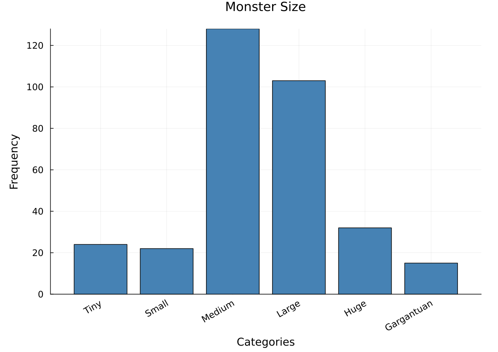
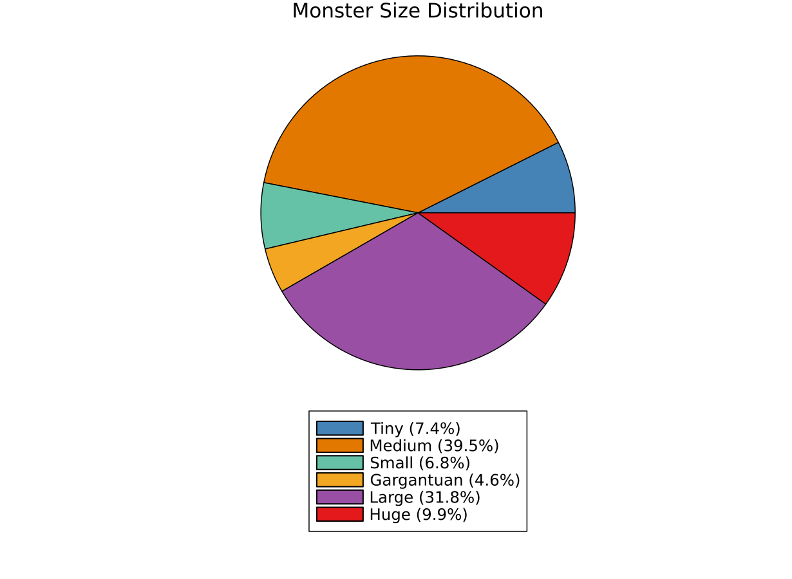
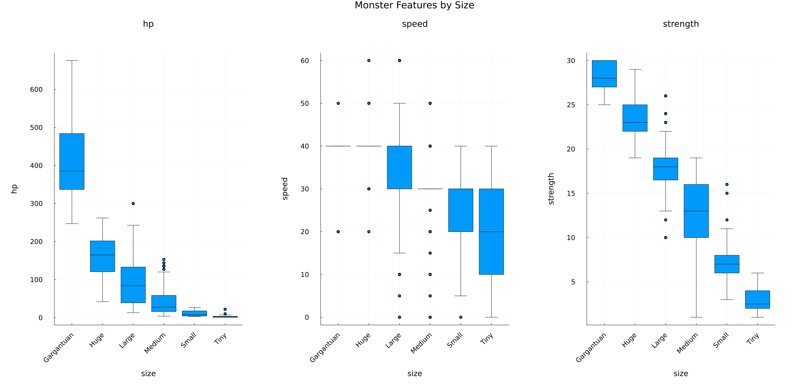
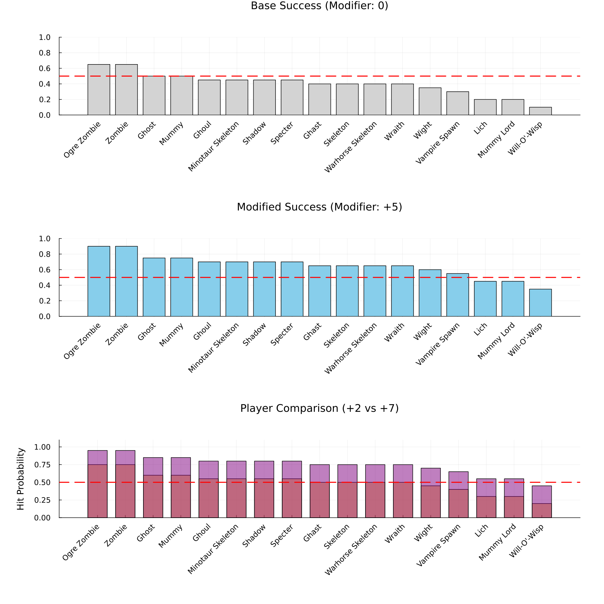

# Make Data-Informed Decisions in Your Campaign: Exploring D&D 5th Edition Monster Features Using Julia

## Learning Objectives

By the end of this notebook, you will be able to:

1. Load, inspect, and clean tabular data using Julia's DataFrames ecosystem
2. Explore categorical and numerical features through summary statistics and visualizations
3. Filter and subset data to answer specific questions about your dataset
4. Apply basic probability to a real decision-making scenario (balancing combat encounters)

---

## Introduction

### What is Dungeons & Dragons?

Dungeons & Dragons (D&D) is a tabletop role-playing game where a group of players create fictional characters and collaboratively navigate a story guided by a **Dungeon Master (DM)**. The DM designs the world, controls non-player characters and monsters, and adjudicates the rules. Combat and skill checks are resolved by rolling polyhedral dice — most commonly a 20-sided die (d20).

Every monster in the game has a stat block: a structured record of its attributes. Three of the most important are:

- **Hit Points (HP):** How much damage a monster can absorb before it is defeated.
- **Armor Class (AC):** The threshold a player must meet or exceed on a d20 roll (plus modifiers) to land a hit.
- **Challenge Rating (CR):** A rough index of how difficult the monster is, meant to help DMs gauge appropriate difficulty for their party.

### Why Data-Informed Dungeon Mastering?

A Dungeon Master preparing a campaign faces a design problem: how do you create encounters that are challenging enough to feel dangerous but fair enough that players stay engaged? The Monster Manual contains hundreds of creatures, each with dozens of attributes. Without organized access to that data, a DM relies on intuition, memory, or flipping through pages, which works most of the time. But sometimes it takes too long for the time whe have to prepare.

Treating monster selection as a **data management problem** changes this. When you can filter, sort, group, and visualize monster attributes programmatically, you gain access to options you might never have found by browsing. You can ask precise questions: *"Which Large undead creatures have an AC below 14?"* or *"How does HP scale with size across monster types?"*. You can document your encounter-building rationale, reproduce it, and refine it between sessions.

This is the same principle behind any evidence-based workflow. In experimental design, clinical research, or engineering: **good documentation and systematic exploration of your option space lead to better decisions**. In D&D terms, it means more balanced fights, more variety, and ultimately a better experience at the table.

### About This Notebook

This notebook walks through an exploratory data analysis of D&D 5th Edition monster statistics using Julia. The workflow: load, inspect, explore, visualize, filter, analyze, is universal and transfers directly to any tabular dataset in any domain.

---

## Section 1: Setup and Data Loading

```julia
using CSV
using DataFrames
using DataFramesMeta
using Statistics
using Random
using StatsPlots

# Global plot defaults for readability
default(
    size = (820, 580),
    guidefontsize = 12,
    tickfontsize = 10,
    titlefontsize = 14,
    legendfontsize = 11,
    fontfamily = "sans-serif",
    margin = 5Plots.mm,
    dpi = 150
)
```

A **DataFrame** is essentially a spreadsheet in code — rows are individual records (monsters), and columns are attributes (HP, size, type). This structure makes it easy to filter, group, summarize, and visualize patterns. DataFrames work the same way for any tabular data: survey responses, experimental measurements, game telemetry, or biological sequences.

To load a CSV file into a DataFrame in Julia:

```julia
df_monsters = CSV.read("cleaned_monsters_basic.csv", DataFrame);
```

This data was downloaded [from Kaggle](https://www.kaggle.com/datasets/travistyler/dnd-5e-monster-manual-stats).

### Inspecting column names

Before any analysis, check what features (columns) are available:

```julia
for name in names(df_monsters)
    print(name, "\t")
end
```

    Column1  name  size  monster_type  alignment  ac  hp  strength  str_mod  dex  dex_mod  con  con_mod  intel  int_mod  wis  wis_mod  cha  cha_mod  senses  languages  cr  str_save  dex_save  con_save  int_save  wis_save  cha_save  speed  swim  fly  climb  burrow  number_legendary_actions  history  perception  stealth  persuasion  insight  deception  arcana  religion  acrobatics  athletics  intimidation

The dataset contains 45 columns. For this notebook, we will focus on a manageable subset: **size**, **monster_type**, **alignment**, **hp**, **ac**, **cr**, **speed**, and **strength**.

---

## Section 2: Exploring Categorical Features

Before computing any statistics, you need to know what values actually exist in your data. This prevents surprises like typos ("large" vs "Large"), unexpected categories, or missing entries — a step analogous to checking your reagent labels before running an experiment.

### How many different sizes exist?

```julia
unique(df_monsters[!, :size])
```

    6-element Vector{String15}:
     "Large"
     "Medium"
     "Huge"
     "Gargantuan"
     "Small"
     "Tiny"

---

## Section 3: Visualizing Distributions

### Bar plot: Monster count by size

When you have discrete categories (Small, Medium, Large), bar charts make comparison intuitive — taller bars mean more items. Sorting bars by a logical order (Tiny → Gargantuan) or by frequency helps you immediately spot which categories dominate and which are rare.

```julia
function plot_frequency_distribution(string_array; title="Frequency Distribution", size=(800,600), rotation=45, var_order=nothing)
    freq_dict = Dict{String, Int}()
    for s in string_array
        freq_dict[s] = get(freq_dict, s, 0) + 1
    end
    
    sorted_pairs = sort(collect(freq_dict), by=x->x[2], rev=true)
    
    if var_order !== nothing
        if length(var_order) != length(sorted_pairs)
            error("var_order length ($(length(var_order))) must match number of unique elements ($(length(sorted_pairs)))")
        end
        ordered_pairs = [sorted_pairs[i] for i in var_order]
    else
        ordered_pairs = sorted_pairs
    end
    
    labels = [pair[1] for pair in ordered_pairs]
    counts = [pair[2] for pair in ordered_pairs]
    
    bar(labels, counts, 
        title=title,
        xlabel="Categories", 
        ylabel="Frequency",
        size=size,
        xrotation=rotation,
        legend=false,
        color=:steelblue)
end
```

```julia
plot_frequency_distribution(df_monsters[!, :size], title="Monster Size", var_order=[4, 5, 1, 2, 3, 6])
```



**What to notice:** Medium monsters dominate the dataset (~50%), reflecting the Monster Manual's emphasis on humanoid-scale enemies. For a DM, this means the most variety is available in the Medium category — but if you want Large or Huge creatures for dramatic set-piece encounters, your options narrow, making systematic filtering more valuable.

### Pie chart: Size as proportion of the whole

Pie charts work best when you want to emphasize that categories are parts of a whole (100%). "Half of all monsters are Medium-sized" reads more intuitively as a pie slice than a bar. Avoid pie charts when you have more than 5–6 categories.

```julia
function pie_chart_feat(string_array; title="PieChart Distribution", size=(600,400), legendfontsize=10)
    freq_dict = Dict{String, Int}()
    for s in string_array
        freq_dict[s] = get(freq_dict, s, 0) + 1
    end
    
    labels = collect(keys(freq_dict))
    counts = collect(values(freq_dict))
    total = sum(counts)
    percentages = round.((counts ./ total) .* 100, digits=1)
    labels_with_pct = [string(label, " (", pct, "%)") for (label, pct) in zip(labels, percentages)]
    
    pie(labels_with_pct, counts, title=title, legend=:outertopright, size=size, legendfontsize=legendfontsize)
end
```

```julia
pie_chart_feat(df_monsters[!,:size], title="Monster Size Distribution", size=(1000,800), legendfontsize=16)
```



### Boxplots: How do numerical features vary across sizes?

Both boxplots and violin plots show how numerical values distribute across categories. **Boxplots** display the median (center line), the interquartile range (the box covers the middle 50% of your data), and outliers (dots beyond the whiskers). **Violin plots** add a density curve showing the full shape of the distribution, which can reveal patterns that boxplots hide — such as bimodal distributions or heavy skew.

Use boxplots for clean, compact comparisons. Use violin plots when you want to see the full distributional shape.

The `DataFramesMeta` package provides the `@groupby` macro, which partitions a DataFrame into sub-tables by a categorical variable — similar to SQL's `GROUP BY` or pandas' `groupby()`.

```julia
function plot_distributions_by_category(df, categorical_col, numeric_cols; title="Distributions by Category", size=(1600, 600), plot_type=:boxplot)
    grouped_df = @groupby(df, categorical_col)
    categories = [key[categorical_col] for key in keys(grouped_df)]
    
    n_plots = length(numeric_cols)
    n_cols = min(3, n_plots)
    n_rows = ceil(Int, n_plots / n_cols)
    
    plots_array = []
    
    for (i, col) in enumerate(numeric_cols)
        all_values = Float64[]
        all_labels = String[]
        
        for category in categories
            category_data = grouped_df[(;Dict(categorical_col => category)...)]
            values = category_data[!, col]
            clean_values = filter(!ismissing, values)
            clean_values = Float64.(clean_values)
            
            if !isempty(clean_values)
                append!(all_values, clean_values)
                append!(all_labels, fill(string(category), length(clean_values)))
            end
        end
        
        if plot_type == :violin
            p = violin(all_labels, all_values, title=string(col), xlabel=string(categorical_col), ylabel=string(col), legend=false)
        elseif plot_type == :boxplot
            p = boxplot(all_labels, all_values, title=string(col), xlabel=string(categorical_col), ylabel=string(col), legend=false)
        else
            error("plot_type must be :violin or :boxplot")
        end
        
        push!(plots_array, p)
    end
    
    final_plot = plot(plots_array..., layout=(n_rows, n_cols), size=size, plot_title=title)
    return final_plot
end
```

```julia
plot_distributions_by_category(df_monsters, :size, [:hp, :speed, :strength])
```



**What to notice:** HP scales strongly with size — Gargantuan creatures have median HP far above the others, with wide spread. Speed is relatively consistent across sizes (most creatures move 30–40 ft), but Gargantuan creatures show more variance. Strength increases with size as expected, but the overlap between Medium and Large is substantial, meaning a Large creature is not always stronger than a Medium one. For a DM, this means **size alone is not a reliable proxy for difficulty** — you need to look at the full stat profile.

---

## Section 4: Filtering and Subsetting

Real analysis rarely uses the entire dataset at once. You filter to answer specific questions: *"Which genes are upregulated more than 2-fold?"*, *"Which patients are over 65 with blood pressure below a threshold?"*, or in our case, *"Which Large monsters have surprisingly low HP?"*

### Are there Large monsters with low HP?

Using the `@subset` macro from `DataFramesMeta`, we can combine conditions. The dot (`.`) prefix on operators means "apply element-wise" — Julia checks each row individually.

```julia
using DataFramesMeta

low_hp_large = @subset(df_monsters, :hp .< 20, :size .== "Large")
```

This returns 13 monsters — all Beasts (Axe Beak, Camel, Elk, various horses and Giant animals) plus the Hippogriff (a Monstrosity). Their HP ranges from 13 to 19, and their CRs are all 1 or below. These are large-bodied but fragile creatures — useful for encounters where you want imposing visuals without deadly stakes, such as wildlife encounters in travel sequences.

### Filtering by multiple categories

For more complex selections — say you are a DM looking for Small-to-Large Aberrations and Dragons:

```julia
monster_sizes = ["Small", "Medium", "Large"]
monster_types = ["Aberration", "Dragon"]

monster_options = @subset(df_monsters, :size .∈ Ref(monster_sizes), :monster_type .∈ Ref(monster_types));
```

```julia
size(monster_options)[1]
```

    26

This gives 26 candidates to work with — a manageable pool to browse and select from.

### Random selection

When you have a filtered pool and want to pick one at random (for a random encounter table, or just to break decision paralysis), Julia's `rand()` function simulates a dice roll:

```julia
monster_dice_roll = rand(1:size(monster_options, 1))
monster_options[monster_dice_roll, :]
```

Random selection is also foundational in data science more broadly: train/test splits in machine learning, bootstrap sampling in statistics, and randomized assignment in experimental design all rely on this same operation.

### Campaign-specific filtering with regex

Most encounter-building decisions depend on the campaign or adventure. If you're running *Curse of Strahd*, you might want Undead creatures specifically. The `@subset` macro works with regular expressions via `occursin()`:

```julia
rege = r"Undead"i
my_monster_selection = @subset(df_monsters, occursin.(rege, :monster_type))
```

This returns 18 Undead monsters, ranging from the lowly Skeleton (CR 1/4) to the Lich (CR 21) and Vampire (CR 13). Having this pool organized and queryable lets you design a progression of encounters across the campaign.

---

## Section 5: Applied Analysis — Balancing a Fight

Balancing combat requires more than random sampling. A good encounter strikes a balance between challenge and fun. One concrete question a DM can ask is: **what is the probability that my players will hit a given monster on any single attack roll?**

### A brief probability primer

A d20 roll produces a **uniform distribution** over the integers $\{1, 2, ..., 20\}$ — each outcome has a $\frac{1}{20} = 5\%$ chance. To hit a monster, the player needs:

$$
\text{d20 roll} + \text{modifier} \geq \text{AC}
$$

So the probability of hitting is:

$$
P(\text{hit}) = \frac{\text{number of rolls that meet or exceed (AC - modifier)}}{20}
$$

With two special cases from the D&D rules: a natural 20 always hits (minimum 5% chance regardless of AC), and a natural 1 always misses (maximum 95% chance regardless of modifier).

This is structurally identical to any threshold-detection problem — asking "what fraction of my sensor readings will exceed this alarm threshold?" or "what is the probability a test score falls above the passing grade?"

### Calculating hit probabilities across Undead monsters

We compute hit probability for four scenarios: no modifier, a +5 modifier, and two players with +2 and +7 respectively.

```julia
function calculate_d20_probability(threshold::Int, modifier::Int)
    effective_threshold = threshold - modifier
    if effective_threshold > 20
        return 0.05  # Natural 20 always hits
    elseif effective_threshold <= 1
        return 0.95  # Natural 1 always misses
    else
        favorable_outcomes = 21 - effective_threshold
        return favorable_outcomes / 20.0
    end
end

# Data Preparation
df = CSV.read("cleaned_monsters_basic.csv", DataFrame)
filtered_df = filter(row -> row.monster_type == "Undead", df)
sort!(filtered_df, :ac)

# Define scenarios
mod_0 = 0
mod_5 = 5
p1_mod = 2
p2_mod = 7

# Calculate probabilities
names = filtered_df.name
chance_0 = calculate_d20_probability.(Int.(filtered_df.ac), Ref(mod_0))
chance_5 = calculate_d20_probability.(Int.(filtered_df.ac), Ref(mod_5))
chance_p1 = calculate_d20_probability.(Int.(filtered_df.ac), Ref(p1_mod))
chance_p2 = calculate_d20_probability.(Int.(filtered_df.ac), Ref(p2_mod))

# Plot 1: No Modifier
p1 = bar(names, chance_0,
    title = "Base Success (Modifier: 0)", 
    color = :lightgrey, 
    xticks = :all, xrotation = 45, ylims = (0, 1), legend = false)
hline!([0.5], color=:red, linewidth=2, linestyle=:dash)

# Plot 2: Single Modifier (+5)
p2 = bar(names, chance_5,
    title = "Modified Success (Modifier: +5)", 
    color = :skyblue, 
    xticks = :all, xrotation = 45, ylims = (0, 1), legend = false)
hline!([0.5], color=:red, linewidth=2, linestyle=:dash)

# Plot 3: Player Comparison
p3 = bar(names, [chance_p1 chance_p2],
    title = "Player Comparison (+2 vs +7)",
    label = ["Player 1 (+2)" "Player 2 (+7)"],
    color = [:orange :purple],
    fillalpha = 0.5,
    linealpha = 1.0,
    ylabel = "Hit Probability",
    xticks = :all,
    xrotation = 45,
    ylims = (0, 1.1),
    bar_width = 0.7,
    legend = false)
hline!([0.5], color=:red, linewidth=2, linestyle=:dash)

plot(p1, p2, p3, layout = (3, 1), size = (1200, 1200), margin = 10Plots.mm)
```



**What to notice:** The red dashed line marks 50% — the coin-flip threshold. With no modifier (top panel), most Undead monsters sit at or below a 50% hit rate, meaning players will miss more often than they hit. The Zombie and Ogre Zombie (AC 8) are the easiest to hit. Adding a +5 modifier (middle panel) pushes nearly every monster above the 50% line — the encounter feels much more manageable.

The bottom panel is where it gets interesting for DMs. Player 1 (+2) struggles against AC 16+ monsters (Vampire, Lich), dropping to around 35% hit chance, while Player 2 (+7) stays above 50% against everything. This asymmetry matters: if you put a Vampire against this party, Player 1 will feel ineffective in direct combat, which might be frustrating — or might be a deliberate design choice that pushes them toward creative problem-solving. The data lets you make that choice intentionally rather than discovering it mid-session.

---

## Summary

This notebook demonstrated a universal data analysis workflow applied to D&D monster statistics:

1. **Load and inspect** your data to understand its structure and available features.
2. **Explore categorical variables** (size, type) to see what categories exist and how they're distributed.
3. **Visualize distributions** to compare numerical features (HP, speed, strength) across groups.
4. **Filter and subset** to answer specific questions relevant to your use case.
5. **Apply quantitative reasoning** — here, basic probability — to inform decisions.

The tools and thinking transfer directly to any domain with tabular data: ecological surveys, clinical records, economic indicators, or sensor measurements. The key insight is the same in all of them: systematically exploring your data gives you access to options and patterns that intuition alone would miss. For a Dungeon Master, that means better-balanced encounters, more variety, and more confidence in design choices. For a researcher, it means better experimental design and more robust conclusions.

---

## Appendix: Julia ↔ Python Quick Reference

If you're coming from Python with pandas and matplotlib, Julia will feel familiar. The syntax is clean and readable, but Julia compiles your code, which typically results in faster execution.

| Concept                   | Python (pandas)               | Julia (DataFrames.jl)            |
|---------------------------|-------------------------------|----------------------------------|
| Import library            | `import pandas as pd`         | `using DataFrames`               |
| Read CSV                  | `df = pd.read_csv(...)`       | `df = CSV.read(..., DataFrame)`  |
| Access column             | `df['column']`                | `df[!, :column]`                |
| Unique values             | `df['col'].unique()`          | `unique(df[!, :col])`           |
| Row count                 | `df.shape[0]`                 | `size(df, 1)`                   |
| Filter rows               | `df[df['hp'] < 20]`          | `@subset(df, :hp .< 20)`       |
| Group by                  | `df.groupby('col')`          | `@groupby(df, :col)`           |
| Random sample             | `df.sample(1)`               | `df[rand(1:nrow(df)), :]`      |
| Bar plot                  | `df['col'].value_counts().plot(kind='bar')` | `bar(labels, counts)` |
| Boxplot                   | `sns.boxplot(x=..., y=...)`  | `boxplot(labels, values)`       |

The `!` in `df[!, :column]` means "give me the actual column, not a copy." Think of it as Julia being explicit about data access.